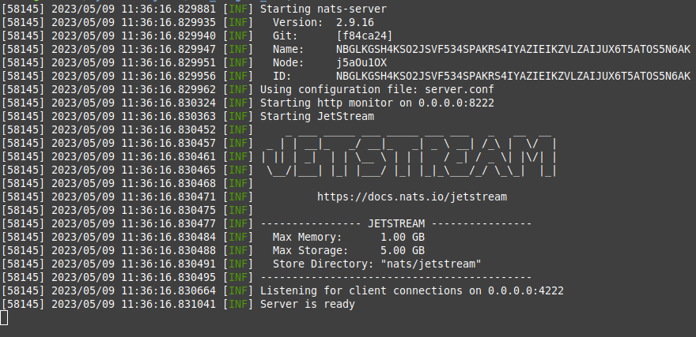
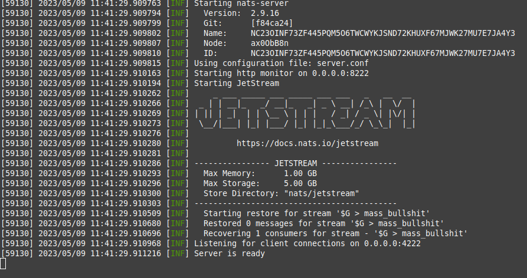

и так, это мини-гайд как сделать стрим, консьюмера, и бакеты. начнем!

если до сих пор не установил `nats-server`, тогда самое время это сделать!
перейди по этой ссылке: https://github.com/nats-io/nats-server/releases/ и скачай самую новую версию. после этого, нужно скачать [nats](https://github.com/nats-io/natscli/releases) и [nats top](https://github.com/nats-io/nats-top/releases) для полной красоты. после всего этого, нужно создать файл server.conf и написать туда:
```
jetstream {
    store_dir='nats/'
    max_mem: "1G"
    max_file: "5G"
}
http_port: 8222
```
сохранить и написать команду `nats-server -c server.conf` в той же директории, где создал файлик `server.conf`

если всё получилось, тогда должна быть примерно следующая картина:


если появилась ошибка или еще что-то, милости прошу идти в google.com

теперь создай новую вкладку в терминале и напиши туда `nats stream add` с таким конфигом:


после этого, нужно создать consumer. напиши команду `nats consumer add` с следующим конфигом:


иногда нужно создать бакеты. чтобы это сделать, напиши команду: `nats kv add name —history=5 —storage=file` . эта команда создаст бакет с именем `name`(имена бакетов, которые нужно создать я буду указывать в README.md)

если всё было сделано правильно, тогда в конце должен быть такой результат(без бакетов):



так же если хотите, чтоб натс использовал больше железа, тогда можно изменить параметры `max_mem` и `max_file` на большее значение, или же вовсе удалить эти параметры. в этом случае натс будет использовать всё железо


скачать prometheus-nats-exporter для графаны(необязательно): [ссылка](https://github.com/nats-io/prometheus-nats-exporter/releases)

наш чат: https://t.me/nats_py

на этом, пожалуй, всё. спасибо за внимание!
